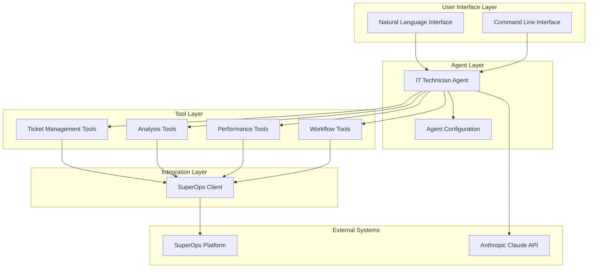

# Design Document

## Overview

The AI IT Technician Assistant is designed as a modular, extensible system that integrates with SuperOps IT service management platform to provide intelligent automation and productivity enhancement for IT technicians. The system follows a layered architecture with clear separation of concerns, enabling maintainability, testability, and scalability.

The core design philosophy emphasizes:
- **Modularity**: Each component has a single responsibility and can be developed/tested independently
- **Extensibility**: New tools and capabilities can be added without modifying existing code
- **Integration**: Seamless integration with SuperOps GraphQL API and potential future platforms
- **Intelligence**: AI-powered analysis and decision-making throughout the system
- **User Experience**: Natural language interface with conversational AI capabilities

## Architecture

### High-Level Architecture



### Component Architecture

The system is organized into the following key components:

1. **Single Agent**: One comprehensive IT Technician Agent that handles all functionality
2. **Tool System**: Modular tools for specific IT operations (tickets, analysis, tracking)
3. **Integration Layer**: SuperOps GraphQL client matching existing implementation
4. **Configuration**: Simple configuration management matching existing AgentConfig

## Components and Interfaces

### 1. Single Agent Architecture

#### ITTechnicianAgent (extends existing BaseAgent)
```python
class ITTechnicianAgent(BaseAgent):
    """Single comprehensive agent for IT technician assistance"""
    
    def __init__(self, config: AgentConfig):
        super().__init__(config)
        self.superops_client = SuperOpsClient(config)
        self.tools = self._initialize_tools()
        
    def get_tools(self) -> List[Any]:
        """Return all available tools for the agent"""
        return [
            CreateTicketTool(self.superops_client),
            AssignTicketTool(self.superops_client),
            AnalyzeRequestTool(),
            LogWorkTool(self.superops_client),
            GenerateMetricsTool(self.superops_client),
            # Additional tools as needed
        ]
        
    async def process_request(self, request: str, context: Optional[Dict] = None) -> str:
        """Process natural language requests and execute appropriate tools"""
        
    def _initialize_tools(self) -> Dict[str, Any]:
        """Initialize all tools with proper configuration"""
```

### 2. Enhanced Tool System

#### BaseTool (Enhanced)
```python
class BaseTool(ABC):
    """Enhanced base tool with validation and error handling"""
    
    def __init__(self, name: str, description: str):
        self.name = name
        self.description = description
        self.logger = get_logger(f"Tool.{name}")
    
    @abstractmethod
    def get_parameters(self) -> Dict[str, Any]
    
    @abstractmethod
    async def execute(self, **kwargs) -> ToolResult
    
    def validate_parameters(self, params: Dict) -> ValidationResult
    
    async def pre_execute_hook(self, params: Dict) -> Dict
    
    async def post_execute_hook(self, result: ToolResult) -> ToolResult
```

#### Ticket Management Tools
- **CreateTicketTool**: Enhanced with AI-powered categorization
- **UpdateTicketTool**: Status updates and progress tracking
- **AssignTicketTool**: Intelligent assignment based on workload and expertise
- **ResolveTicketTool**: Resolution with automatic time logging
- **SearchTicketsTool**: Advanced search with filters and AI-powered suggestions

#### Analysis Tools
- **AnalyzeRequestTool**: AI-powered request analysis and categorization
- **GenerateSuggestionsTool**: Intelligent recommendations based on historical data
- **TroubleshootingGuideTool**: Step-by-step guides for common issues
- **KnowledgeSearchTool**: Search internal knowledge base and documentation

#### Performance Tools
- **TrackWorkTimeTool**: Automatic time tracking with activity detection
- **GenerateMetricsTool**: Performance analytics and reporting
- **WorkloadAnalysisTool**: Workload distribution and optimization suggestions
- **ProductivityInsightsTool**: AI-powered productivity analysis

#### Workflow Tools
- **AutomateWorkflowTool**: Execute predefined automation sequences
- **CreateWorkflowTool**: Define custom automation workflows
- **ScheduleTaskTool**: Schedule recurring tasks and reminders
- **NotificationTool**: Send notifications and alerts

### 3. Tool Integration (No Separate Services)

All business logic is embedded directly in the tools and the single agent, following your existing pattern:

#### Tool Categories
- **Ticket Tools**: Create, update, assign, resolve tickets (extending existing pattern)
- **Analysis Tools**: AI-powered request analysis and suggestions (new)
- **Performance Tools**: Time tracking and metrics generation (new)
- **Workflow Tools**: Simple automation within individual tools (new)

Each tool follows the existing pattern with `execute()` method and parameter validation.

### 4. SuperOps Integration (Minimal Extensions)

#### SuperOpsClient (Extend Existing)
The existing SuperOpsClient will be extended with only essential methods:

```python
class SuperOpsClient:
    """Extend existing client with minimal additional methods"""
    
    # Keep all existing methods (create_ticket, update_ticket, etc.)
    
    async def log_work_time(self, ticket_id: str, time_entry: Dict) -> Dict:
        """Log work time for performance tracking"""
        
    async def get_ticket_metrics(self, date_range: str) -> Dict:
        """Get basic ticket metrics for performance analysis"""
        
    async def search_tickets(self, filters: Dict) -> List[Dict]:
        """Simple ticket search for analysis tools"""
```

### 5. Simple Data Models (Extend Existing)

#### Minimal Additional Models
```python
@dataclass
class WorkTimeEntry:
    ticket_id: str
    duration_minutes: int
    description: str
    timestamp: datetime

@dataclass
class AnalysisResult:
    category: str
    priority: str
    suggestions: List[str]
    confidence: float

# Keep existing models: TicketCreate, Priority, Status, etc.
```

## Error Handling

### Error Hierarchy
```python
class ITAgentError(Exception):
    """Base exception for IT Agent errors"""

class ToolExecutionError(ITAgentError):
    """Error during tool execution"""

class SuperOpsIntegrationError(ITAgentError):
    """Error in SuperOps integration"""

class AnalysisError(ITAgentError):
    """Error in AI analysis"""

class WorkflowError(ITAgentError):
    """Error in workflow execution"""
```

### Error Handling Strategy
- **Graceful Degradation**: System continues operating with reduced functionality
- **Retry Logic**: Automatic retry for transient failures with exponential backoff
- **Error Logging**: Comprehensive error logging with context and stack traces
- **User Feedback**: Clear, actionable error messages for users
- **Fallback Mechanisms**: Alternative approaches when primary methods fail

## Testing Strategy

### Unit Testing
- **Tool Testing**: Individual tool functionality with mocked dependencies
- **Service Testing**: Business logic testing with isolated components
- **Client Testing**: SuperOps client testing with mock GraphQL responses
- **Agent Testing**: Agent behavior testing with controlled scenarios

### Integration Testing
- **API Integration**: End-to-end testing with SuperOps sandbox environment
- **Workflow Testing**: Complete workflow execution testing
- **Performance Testing**: Load testing for concurrent operations
- **Error Scenario Testing**: Testing error handling and recovery

### Test Structure
```
tests/
├── unit/
│   ├── tools/
│   ├── services/
│   ├── agents/
│   └── clients/
├── integration/
│   ├── superops/
│   ├── workflows/
│   └── end_to_end/
└── fixtures/
    ├── mock_data/
    └── test_configs/
```

### Testing Tools and Frameworks
- **pytest**: Primary testing framework
- **pytest-asyncio**: Async testing support
- **pytest-mock**: Mocking and patching
- **factory-boy**: Test data generation
- **responses**: HTTP request mocking
- **coverage.py**: Code coverage analysis

## Security Considerations

### Authentication and Authorization
- **API Key Management**: Secure storage and rotation of SuperOps API keys
- **Token Validation**: Validation of authentication tokens and sessions
- **Role-Based Access**: Different permission levels for different user roles
- **Audit Logging**: Comprehensive logging of all security-relevant events

### Data Protection
- **Encryption**: Encryption of sensitive data at rest and in transit
- **Data Sanitization**: Sanitization of logs and error messages
- **PII Handling**: Proper handling of personally identifiable information
- **Secure Communication**: TLS/SSL for all external communications

### Input Validation
- **Parameter Validation**: Strict validation of all input parameters
- **SQL Injection Prevention**: Parameterized queries and input sanitization
- **XSS Prevention**: Output encoding and input validation
- **Rate Limiting**: Protection against abuse and DoS attacks

## Performance Optimization

### Caching Strategy
- **Response Caching**: Cache frequently accessed SuperOps data
- **Analysis Caching**: Cache AI analysis results for similar requests
- **Session Caching**: Cache user session data and preferences
- **Intelligent Invalidation**: Smart cache invalidation based on data changes

### Asynchronous Operations
- **Concurrent Processing**: Parallel execution of independent operations
- **Background Tasks**: Long-running operations executed in background
- **Queue Management**: Task queuing for resource-intensive operations
- **Connection Pooling**: Efficient connection management for external APIs

### Resource Management
- **Memory Optimization**: Efficient memory usage and garbage collection
- **Connection Limits**: Proper connection pooling and limits
- **Timeout Management**: Appropriate timeouts for external operations
- **Resource Cleanup**: Proper cleanup of resources and connections

## Deployment and Configuration

### Configuration Management
```python
@dataclass
class AgentConfig:
    # SuperOps Configuration
    superops_api_url: str
    superops_api_key: str
    
    # AI Configuration
    anthropic_api_key: str
    model_name: str = "claude-3-sonnet-20240229"
    max_tokens: int = 4000
    temperature: float = 0.1
    
    # Performance Configuration
    cache_ttl: int = 3600
    max_concurrent_requests: int = 10
    request_timeout: int = 30
    
    # Feature Flags
    enable_ai_analysis: bool = True
    enable_auto_assignment: bool = True
    enable_workflow_automation: bool = True
```

### Environment Setup
- **Development**: Local development with mock services
- **Testing**: Automated testing environment with test data
- **Staging**: Pre-production environment with SuperOps sandbox
- **Production**: Production environment with full SuperOps integration

### Monitoring and Observability
- **Application Metrics**: Performance metrics and KPIs
- **Error Tracking**: Error monitoring and alerting
- **Usage Analytics**: Usage patterns and user behavior analysis
- **Health Checks**: System health monitoring and status reporting