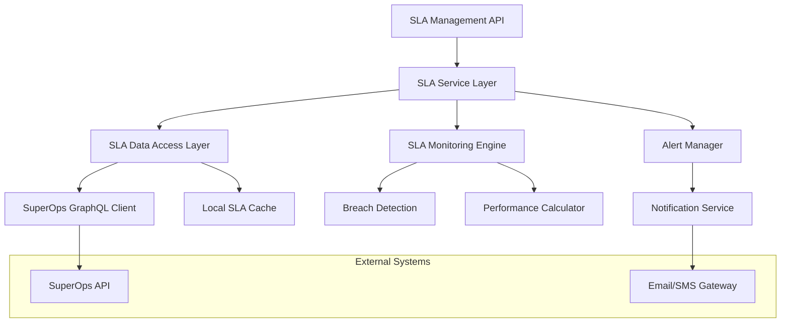

# Design Document

## Overview

The SLA Management Tools system provides comprehensive Service Level Agreement monitoring and management capabilities by integrating with the SuperOps API. The system follows a modular architecture with dedicated components for SLA data retrieval, monitoring, alerting, and reporting.

## Architecture

The system implements a layered architecture with the following components:



### Core Components

1. **SLA Service Layer**: Main business logic for SLA operations
2. **SLA Data Access Layer**: Handles data retrieval and caching
3. **SLA Monitoring Engine**: Real-time SLA tracking and calculations
4. **Alert Manager**: Handles breach notifications and escalations
5. **SuperOps GraphQL Client**: API integration layer

## Components and Interfaces

### SLAService

Primary service class that orchestrates all SLA operations:

```python
class SLAService:
    async def get_sla_policies() -> List[SLAPolicy]
    async def get_ticket_sla_status(ticket_id: str) -> TicketSLAStatus
    async def get_technician_sla_performance(technician_id: str) -> TechnicianSLAMetrics
    async def monitor_sla_breaches() -> List[SLABreach]
    async def generate_sla_report(date_range: DateRange) -> SLAReport
```

### SLADataAccess

Handles all data operations with caching and API integration:

```python
class SLADataAccess:
    async def fetch_sla_policies_from_api() -> List[SLAPolicy]
    async def get_cached_sla_policies() -> List[SLAPolicy]
    async def fetch_ticket_sla_data(ticket_id: str) -> TicketSLAData
    async def fetch_technician_metrics(technician_id: str) -> TechnicianMetrics
    async def update_sla_cache(policies: List[SLAPolicy]) -> None
```

### SLAMonitoringEngine

Real-time monitoring and calculation engine:

```python
class SLAMonitoringEngine:
    async def calculate_sla_status(ticket: Ticket, sla_policy: SLAPolicy) -> SLAStatus
    async def detect_potential_breaches() -> List[PotentialBreach]
    async def calculate_technician_performance(technician_id: str) -> PerformanceMetrics
    async def start_monitoring() -> None
    async def stop_monitoring() -> None
```

### AlertManager

Manages SLA breach notifications and escalations:

```python
class AlertManager:
    async def send_breach_alert(breach: SLABreach) -> None
    async def send_warning_alert(warning: SLAWarning) -> None
    async def escalate_breach(breach: SLABreach) -> None
    async def configure_alert_rules(rules: List[AlertRule]) -> None
```

## Data Models

### SLAPolicy

```python
@dataclass
class SLAPolicy:
    id: str
    name: str
    priority_level: str
    response_time_minutes: int
    resolution_time_hours: int
    business_hours_only: bool
    escalation_rules: List[EscalationRule]
    created_at: datetime
    updated_at: datetime
```

### TicketSLAStatus

```python
@dataclass
class TicketSLAStatus:
    ticket_id: str
    sla_policy: SLAPolicy
    response_time_remaining: timedelta
    resolution_time_remaining: timedelta
    is_response_breached: bool
    is_resolution_breached: bool
    breach_risk_level: str  # LOW, MEDIUM, HIGH, CRITICAL
    last_updated: datetime
```

### TechnicianSLAMetrics

```python
@dataclass
class TechnicianSLAMetrics:
    technician_id: str
    technician_name: str
    total_tickets: int
    sla_compliant_tickets: int
    compliance_rate: float
    average_response_time: timedelta
    average_resolution_time: timedelta
    breach_count: int
    performance_trend: str  # IMPROVING, STABLE, DECLINING
    period_start: datetime
    period_end: datetime
```

### SLABreach

```python
@dataclass
class SLABreach:
    id: str
    ticket_id: str
    breach_type: str  # RESPONSE, RESOLUTION
    breach_time: datetime
    sla_policy: SLAPolicy
    technician_id: str
    severity: str  # LOW, MEDIUM, HIGH, CRITICAL
    customer_impact: str
    escalation_required: bool
```

## Error Handling

### API Error Handling

1. **Connection Errors**: Implement exponential backoff retry mechanism
2. **Rate Limiting**: Respect API rate limits with intelligent queuing
3. **Authentication Errors**: Automatic token refresh and re-authentication
4. **Data Validation Errors**: Comprehensive input validation with detailed error messages

### SLA Calculation Errors

1. **Missing Data**: Graceful degradation with partial SLA status
2. **Invalid Timestamps**: Data sanitization and correction
3. **Policy Conflicts**: Priority-based resolution with logging
4. **Cache Inconsistencies**: Automatic cache invalidation and refresh

### Monitoring Errors

1. **Monitoring Service Failures**: Automatic restart with state recovery
2. **Alert Delivery Failures**: Multiple delivery channels with fallback
3. **Performance Calculation Errors**: Error isolation with continued monitoring

## Testing Strategy

### Unit Testing

1. **SLA Calculation Logic**: Test all SLA status calculations with various scenarios
2. **Data Access Layer**: Mock API responses and test data transformation
3. **Alert Logic**: Test breach detection and notification triggers
4. **Performance Metrics**: Validate technician performance calculations

### Integration Testing

1. **SuperOps API Integration**: Test real API calls with test data
2. **Database Operations**: Test SLA data persistence and retrieval
3. **Cache Operations**: Test cache consistency and invalidation
4. **End-to-End Workflows**: Test complete SLA monitoring workflows

### Performance Testing

1. **API Response Times**: Ensure sub-second response for SLA status queries
2. **Monitoring Scalability**: Test with high ticket volumes (1000+ concurrent)
3. **Cache Performance**: Validate cache hit rates and response times
4. **Alert Processing**: Test alert delivery under high breach volumes

### Error Scenario Testing

1. **API Failures**: Test system behavior during SuperOps API outages
2. **Network Issues**: Test resilience to network connectivity problems
3. **Data Corruption**: Test recovery from corrupted SLA data
4. **High Load**: Test system stability under peak usage conditions

## Security Considerations

### API Security

1. **Authentication**: Secure token management with automatic refresh
2. **Authorization**: Role-based access to SLA data and operations
3. **Data Encryption**: Encrypt sensitive SLA data in transit and at rest
4. **Audit Logging**: Comprehensive logging of all SLA operations

### Data Privacy

1. **PII Protection**: Anonymize customer data in SLA reports
2. **Access Controls**: Restrict SLA data access based on user roles
3. **Data Retention**: Implement SLA data retention policies
4. **Compliance**: Ensure GDPR/CCPA compliance for SLA data handling

## Performance Optimization

### Caching Strategy

1. **SLA Policy Caching**: Cache policies with TTL-based invalidation
2. **Ticket Status Caching**: Cache frequently accessed ticket SLA status
3. **Performance Metrics Caching**: Cache technician metrics with periodic refresh
4. **Query Result Caching**: Cache expensive query results

### Database Optimization

1. **Indexing**: Optimize database indexes for SLA queries
2. **Query Optimization**: Use efficient queries for large datasets
3. **Connection Pooling**: Implement database connection pooling
4. **Batch Operations**: Batch SLA updates for improved performance

### Monitoring Optimization

1. **Intelligent Polling**: Adjust polling frequency based on ticket priority
2. **Event-Driven Updates**: Use webhooks for real-time SLA updates
3. **Parallel Processing**: Process SLA calculations in parallel
4. **Resource Management**: Optimize memory and CPU usage for monitoring